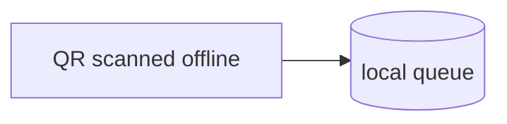
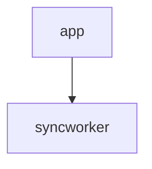

# Design Pipeline Implementation Plan

> **For agentic workers:** REQUIRED SUB-SKILL: Use superpowers:subagent-driven-development (recommended) or superpowers:executing-plans to implement this plan task-by-task. Steps use checkbox (`- [ ]`) syntax for tracking.

**Goal:** Ship `/harness:shape`, a gated design pipeline. `loop-dev` refuses to build a feature whose design is missing, unresolved, or unlocked.

**Architecture:** Two deterministic shell scripts do the enforcement. `design-check.sh` gates `design.md` + `plan.md`, and `render-map.sh` renders `design.md` to a local HTML page. Both have self-tests that prove they can fail. Three model-facing skills feed the gate: `shared:discover`, `harness:attack` and `harness:triage`. One command orchestrates them: `harness:shape`. `loop-dev-preflight.sh` gains a `--plan` flag and a `require_design` mode, so the gate runs before any code is built.

**Tech Stack:** bash 3.2 (macOS `/bin/bash`, so no associative arrays, `mapfile` or `${x,,}`), `jq`, `grep -E`, Markdown skills and commands, and one static HTML template that loads marked, DOMPurify and mermaid from jsdelivr at pinned versions.

**Spec:** `docs/superpowers/specs/2026-09-23-design-pipeline-design.md`. It is approved, and its decisions are not re-opened here. Read it before any task.

## Global Constraints

- Work on branch `feat/design-pipeline`, created from `docs/design-pipeline-spec` so the spec and this plan travel with the code. Never push to `main`.
- `make check` must be green before every commit that touches `plugins/`, `scripts/` or `.claude-plugin/`.
- All scripts must run under bash 3.2. With `set -u`, an empty array expansion is an error there, so use space-separated strings instead of arrays that can be empty.
- Skill frontmatter: `name` equals the directory name. `description` is **quoted**. `user-invocable` is explicit. `argument-hint` is required if and only if the body reads `$ARGUMENTS`. No positional `$0`/`$1`. At most 450 words, or detail moves to `references/`.
- Skills are drafted with `/anthropic-skills:skill-creator`, then conformed to lint. The skill's `scripts/skill-rules/<plugin>__<skill>.rules` manifest is written **before** the body, and it is baselined (every rule matches) before the body is called final.
- Agents: none are added. The model-facing units are skills and a command.
- Decision line grammar, verbatim from the spec: `- [x|~| ] <A|Q|W|B><n> · <severity|byproduct> · <text> · <decided-by: you|accepted-default | ack · decided-by: … | deferred: <reason> | open>`. The separator is ` · ` (U+00B7 with a space on each side).
- `.cc-dev.yaml` key `require_design: never | features | always`. The template (and so `harness-init`) writes `features`. **An absent key means `never`**, so existing installs are not suddenly blocked, which keeps this a minor bump.
- Release, all in this PR: `shared` 2.3.4 → **2.4.0**, `harness` 2.2.0 → **2.3.0**, `feature-bank` 1.2.2 → **1.2.3** (see Task 8), marketplace 6.2.3 → **6.3.0**, a CHANGELOG entry, and README counts of 49 → **52** skills and 6 → **7** commands.
- `docs/reference/compatibility.md` "Gates exercised live" moves **only** after Task 11's real kaffecard run. The PR is not merged before that run.
- Commits are one per functionality, conventional, and written with `/shared:commit-message`. Stage explicit paths only.

## File map

| Path | Status | Responsibility |
|---|---|---|
| `plugins/harness/scripts/design-check.sh` | create | The gate: parse `design.md` frontmatter and decision lines, and cross-check `W` IDs against `plan.md` |
| `plugins/harness/test/design-check.test.sh` | create | Proves each block condition fails, and that a valid design passes |
| `plugins/harness/scripts/render-map.sh` | create | Split `design.md` into sections, embed them as escaped JSON in the template, and write `.wayworks/maps/<slug>.html` |
| `plugins/harness/templates/map.html` | create | Static page: tabs, markdown → DOMPurify → DOM, lazy mermaid, and the Decisions filter |
| `plugins/harness/test/render-map.test.sh` | create | Every section becomes a tab, every Mermaid block and decision line is present, payloads cannot break out, and bad input fails |
| `plugins/harness/templates/design.md` | create | Skeleton that `shape` copies for a new design |
| `plugins/harness/hooks/scripts/loop-dev-preflight.sh` | modify | Adds the `--plan <path>` flag, `require_design` and the design-check call |
| `plugins/harness/test/loop-dev-preflight.test.sh` | modify | Covers the three modes, the absent key, and `--plan` in/out of `docs/designs/` |
| `plugins/harness/templates/.cc-dev.yaml` | modify | `require_design: features` |
| `scripts/skill-rules/harness__triage.rules` | create | Load-bearing rules of triage |
| `plugins/harness/skills/triage/SKILL.md` | create | Batch-decision protocol |
| `scripts/skill-rules/harness__attack.rules` | create | Load-bearing rules of attack |
| `plugins/harness/skills/attack/SKILL.md` (+ `references/lenses.md`) | create | Scaled adversarial panel |
| `scripts/skill-rules/shared__discover.rules` | create | Load-bearing rules of discover |
| `plugins/shared/skills/discover/SKILL.md` | create | Lens-per-subagent research brief |
| `plugins/harness/commands/shape.md` | create | The 9-stage orchestrator |
| `plugins/harness/commands/loop-dev.md` | modify | Design gate, `features` classification, the fold, and `shipped` |
| `plugins/harness/commands/harness-init.md` | modify | `.wayworks/` in the gitignore, and an offer to add `require_design` to an existing `.cc-dev.yaml` |
| `plugins/feature-bank/skills/feature-bank/SKILL.md` | modify | Names the locked-design fold as the one approved body change at postflight |
| `docs/reference/first-party-overlap.md`, `docs/reference/compatibility.md`, `README.md`, `plugins/harness/README.md`, `CHANGELOG.md`, 3× `plugin.json`, `marketplace.json` | modify | Docs and release |

---

### Task 0: Branch

- [ ] **Step 1:** `git switch docs/design-pipeline-spec && git switch -c feat/design-pipeline`
- [ ] **Step 2:** `make check`. Expected: `CHECK GREEN`. This is the baseline. If it is not green, stop and report it; do not build on red.

---

### Task 1: `design-check.sh`, the gate

**Files:**
- Create: `plugins/harness/scripts/design-check.sh`
- Test: `plugins/harness/test/design-check.test.sh` (`scripts/check.sh` already runs every `plugins/harness/test/*.test.sh`)

**Interfaces:**
- Produces: `design-check.sh <design-dir> [--require-locked]`. It reads `<design-dir>/design.md` and `<design-dir>/plan.md`, and prints one `BLOCK: <ID or file>: <reason>` line on **stdout** per violation. It then prints `DESIGN OK — <n> decision(s) checked` or `DESIGN BLOCKED`. Exit codes: `0` ok, `1` blocked, `2` usage error. Task 3 and Task 7 call it.

- [ ] **Step 1: Write the failing test**

`plugins/harness/test/design-check.test.sh`:

```bash
#!/usr/bin/env bash
# Tests for design-check.sh. The gate exists so unsupervised code starts from a
# design with no open question, no unowned decision and no untested what-if. A
# gate that passes everything reads as confirmation, so each block condition is
# asserted to exit non-zero — same contract as scripts/check-skill-rules.test.sh.
set -uo pipefail
SCRIPT=$(cd "$(dirname "$0")/../scripts" && pwd)/design-check.sh
fail=0
ok()  { echo "ok   - $*"; }
bad() { echo "FAIL - $*"; fail=1; }

TMP=$(mktemp -d); trap 'rm -rf "$TMP"' EXIT

GOOD='- [x] W3 · high · QR scanned offline → queue locally · decided-by: you
- [x] B2 · byproduct · local stamp queue · ack · decided-by: accepted-default
- [~] A9 · low · second device for same shop · deferred: single-device shops only in v1
- [x] Q1 · med · reward expiry? → 90 days · decided-by: you'

# mk <name> <status>; decision lines on stdin. Plan mentions W3 only.
mk() {
  d="$TMP/$1"; rm -rf "$d"; mkdir -p "$d"
  { printf -- '---\nslug: %s\nstatus: %s\nstage: lock\n---\n# t\n\n## Decisions\n' "$1" "$2"; cat; } > "$d/design.md"
  printf '# Plan\n\n### Task 1: offline queue (W3)\nTest: a scan with no network queues the stamp (W3)\n' > "$d/plan.md"
  echo "$d"
}
run() { OUT=$(bash "$SCRIPT" "$@" 2>&1); RC=$?; }
expect_block() { # $1=label $2=grep pattern
  { [ "$RC" = "1" ] && grep -q -- "$2" <<<"$OUT"; } && ok "$1" || bad "$1 (rc=$RC: $OUT)"
}

# --- valid designs pass -----------------------------------------------------
d=$(mk good locked <<<"$GOOD"); run "$d" --require-locked
{ [ "$RC" = "0" ] && grep -q "DESIGN OK — 4 decision" <<<"$OUT"; } \
  && ok "valid locked design passes" || bad "valid locked design passes (rc=$RC: $OUT)"
d=$(mk gooddraft draft <<<"$GOOD"); run "$d"
[ "$RC" = "0" ] && ok "draft passes without --require-locked (shape's lock stage)" || bad "draft without flag (rc=$RC: $OUT)"

# --- rule 1: open items -----------------------------------------------------
d=$(mk open locked <<<"$GOOD
- [ ] Q4 · med · reward expiry? · open"); run "$d"
expect_block "open item blocks and is named" "BLOCK: Q4"

# --- rule 2: decided-by and ack ---------------------------------------------
d=$(mk noby locked <<<"$GOOD
- [x] Q5 · med · stamp limit → 10/day"); run "$d"
expect_block "decided item without decided-by blocks" "BLOCK: Q5"
d=$(mk badby locked <<<"$GOOD
- [x] Q6 · med · x → y · decided-by: someone"); run "$d"
expect_block "decided-by with an unknown value blocks" "BLOCK: Q6"
d=$(mk noack locked <<<"$GOOD
- [x] B7 · byproduct · retry cache · decided-by: you"); run "$d"
expect_block "byproduct without ack blocks" "BLOCK: B7"
d=$(mk nodefer locked <<<"$GOOD
- [~] A2 · low · kiosk mode"); run "$d"
expect_block "deferred item without a reason blocks" "BLOCK: A2"

# --- rule 3: every decided W appears in plan.md ------------------------------
d=$(mk wmissing locked <<<"$GOOD
- [x] W8 · high · token expires mid-scan → re-auth then retry · decided-by: you"); run "$d"
expect_block "decided what-if absent from plan blocks" "BLOCK: W8"
d=$(mk wboundary locked <<<"$GOOD")
printf '### Task 1 (W30)\n' > "$d/plan.md"; run "$d"
expect_block "W3 is not satisfied by W30 (word boundary)" "BLOCK: W3"
d=$(mk wdeferred locked <<<"$GOOD
- [~] W9 · low · clock skew · deferred: server time only"); run "$d"
[ "$RC" = "0" ] && ok "deferred what-if need not appear in plan" || bad "deferred W should not need a task (rc=$RC: $OUT)"
d=$(mk noplan locked <<<"$GOOD"); rm "$d/plan.md"; run "$d"
expect_block "missing plan.md blocks" "plan.md"

# --- rule 4: status --------------------------------------------------------
d=$(mk draft draft <<<"$GOOD"); run "$d" --require-locked
expect_block "draft with --require-locked blocks" "not locked"
d=$(mk shipped shipped <<<"$GOOD"); run "$d" --require-locked
expect_block "shipped with --require-locked blocks (shipped designs are immutable)" "not locked"
d=$(mk badstatus done <<<"$GOOD"); run "$d"
expect_block "unknown status blocks" "draft|locked|shipped"
d="$TMP/nofm"; mkdir -p "$d"; printf '## Decisions\n%s\n' "$GOOD" > "$d/design.md"; cp "$TMP/good/plan.md" "$d/"; run "$d"
expect_block "missing frontmatter blocks" "frontmatter"

# --- malformed lines -------------------------------------------------------
d=$(mk dash locked <<<"$GOOD
- [x] W4 - high - hyphens instead of middle dots - decided-by: you"); run "$d"
expect_block "wrong separator is malformed" "malformed"
d=$(mk prefix locked <<<"$GOOD
- [x] X1 · high · unknown prefix · decided-by: you"); run "$d"
expect_block "unknown ID prefix is malformed" "malformed"
d=$(mk upper locked <<<"$GOOD
- [X] Q7 · med · capital X · decided-by: you"); run "$d"
expect_block "capital [X] is malformed" "malformed"

# --- empty and fenced ------------------------------------------------------
d=$(mk empty locked </dev/null); run "$d"
expect_block "a design with no decisions blocks (asserts nothing)" "no decision"
d=$(mk fenced locked <<<"$GOOD
\`\`\`
- [ ] Q9 · med · example inside a code fence · open
\`\`\`"); run "$d"
[ "$RC" = "0" ] && ok "checklist lines inside a code fence are ignored" || bad "fenced lines ignored (rc=$RC: $OUT)"

# --- invocation ------------------------------------------------------------
run "$TMP/does-not-exist"
expect_block "missing design dir blocks" "design.md"
run
[ "$RC" = "2" ] && ok "no arguments is a usage error (exit 2)" || bad "usage error (rc=$RC)"
run "$TMP/good" --bogus
[ "$RC" = "2" ] && ok "unknown flag is a usage error (exit 2)" || bad "unknown flag (rc=$RC)"

exit $fail
```

- [ ] **Step 2: Run it and confirm it fails**

Run: `bash plugins/harness/test/design-check.test.sh`
Expected: `FAIL` lines on every case, because the script does not exist yet.

- [ ] **Step 3: Implement**

`plugins/harness/scripts/design-check.sh` (then `chmod +x`):

```bash
#!/usr/bin/env bash
# Deterministic gate over a design: <dir>/design.md + <dir>/plan.md.
#
# Why this exists: /harness:shape moves human supervision to before code, so a
# coding loop can run unattended. That only holds if the design it builds from
# has no open question, every decision says who made it, every byproduct was
# acknowledged, and every what-if became a task with a test. Those are grep-able
# facts, so they are checked here rather than trusted to a model.
#
# Usage: design-check.sh <design-dir> [--require-locked]
#   --require-locked  also require frontmatter status: locked (loop-dev passes it;
#                     shape's lock stage does not, since it locks after this passes)
# Exit 0 = pass, 1 = blocked, 2 = usage error. BLOCK lines go to stdout.
set -uo pipefail
usage() { echo "usage: design-check.sh <design-dir> [--require-locked]" >&2; exit 2; }
[ $# -ge 1 ] || usage
DIR="$1"; shift
REQUIRE_LOCKED=0
for a in "$@"; do
  case "$a" in --require-locked) REQUIRE_LOCKED=1 ;; *) usage ;; esac
done
DESIGN="$DIR/design.md"; PLAN="$DIR/plan.md"

fail=0
block() { echo "BLOCK: $*"; fail=1; }
finish() {
  [ "$fail" -eq 0 ] && echo "DESIGN OK — $n decision(s) checked" || echo "DESIGN BLOCKED"
  exit $fail
}
n=0
[ -f "$DESIGN" ] || { block "design.md: $DESIGN does not exist"; finish; }

# --- frontmatter -----------------------------------------------------------
fm=$(awk 'NR==1 && $0!="---"{exit} NR>1 && $0=="---"{exit} NR>1{print}' "$DESIGN")
if [ -z "$fm" ]; then
  block "design.md: no frontmatter (expected slug, status, stage between --- lines)"
fi
status=$(printf '%s\n' "$fm" | sed -nE 's/^status:[[:space:]]*([A-Za-z]+).*/\1/p' | head -1)
case "$status" in
  draft|locked|shipped) ;;
  *) block "design.md: status '${status:-<missing>}' is not draft|locked|shipped" ;;
esac
if [ "$REQUIRE_LOCKED" -eq 1 ] && [ "$status" != "locked" ]; then
  block "design.md: status is '${status:-<missing>}', not locked — finish it with /harness:shape"
fi

# --- decision lines --------------------------------------------------------
re_line='^- \[([ x~])\] ([AQWB][0-9]+) · (.+)$'
re_by='decided-by: (you|accepted-default)( |$)'
re_ack='(^|· )ack( ·|$)'
decided_w=""
infence=0
while IFS= read -r line || [ -n "$line" ]; do
  case "$line" in '```'*) infence=$((1 - infence)); continue ;; esac
  [ "$infence" -eq 1 ] && continue
  case "$line" in '- ['*) ;; *) continue ;; esac
  n=$((n + 1))
  if ! [[ "$line" =~ $re_line ]]; then
    block "malformed decision line (want '- [x|~| ] <A|Q|W|B><n> · …'): $line"; continue
  fi
  mark="${BASH_REMATCH[1]}"; id="${BASH_REMATCH[2]}"; rest="${BASH_REMATCH[3]}"
  case "$mark" in
    ' ') block "$id: still open — triage it" ;;
    '~') [[ "$rest" == *"deferred:"* ]] || block "$id: deferred without 'deferred: <reason>'" ;;
    x)
      [[ "$rest" =~ $re_by ]] || block "$id: decided but no 'decided-by: you|accepted-default'"
      case "$id" in
        B*) [[ "$rest" =~ $re_ack ]] || block "$id: byproduct not acknowledged ('ack')" ;;
        W*) decided_w="$decided_w $id" ;;
      esac
      ;;
  esac
done < "$DESIGN"
[ "$n" -eq 0 ] && block "design.md: no decision lines — stages 3, 4, 6 and 7 never recorded anything, so this design asserts nothing"

# --- plan cross-check ------------------------------------------------------
if [ ! -f "$PLAN" ]; then
  block "plan.md: $PLAN does not exist — stage 5 must write it"
else
  for id in $decided_w; do
    grep -qw -- "$id" "$PLAN" || block "$id: decided what-if never appears in plan.md — it needs a task with a test"
  done
fi
finish
```

- [ ] **Step 4: Run it and confirm it passes**

Run: `bash plugins/harness/test/design-check.test.sh`
Expected: every line `ok`, exit 0.

- [ ] **Step 5: Mutation check (proves the test can fail)**

Temporarily delete the `B*)` ack line from the script and re-run the test. Expected: `FAIL - byproduct without ack blocks`. Restore it (`git checkout plugins/harness/scripts/design-check.sh` is not available on a new file, so revert by hand) and re-run. Expected: all `ok`.

- [ ] **Step 6:** `make check` → `CHECK GREEN`
- [ ] **Step 7: Commit** `feat: add design-check gate for shaped designs` (`git add plugins/harness/scripts/design-check.sh plugins/harness/test/design-check.test.sh`)

---

### Task 2: `render-map.sh` + `map.html`

**Files:**
- Create: `plugins/harness/templates/map.html`, `plugins/harness/scripts/render-map.sh`
- Test: `plugins/harness/test/render-map.test.sh`

**Interfaces:**
- Produces: `render-map.sh <design-dir> [out-dir]`. `out-dir` defaults to `.wayworks/maps`, relative to the current directory. It writes `<out-dir>/<slug>.html` and prints that path on stdout. Exit codes: `0` ok, `1` bad input, `2` usage. The slug comes from the frontmatter `slug:`, else the directory name, and must match `^[a-z0-9][a-z0-9-]*$`. Task 7 calls it for `--publish`.
- Template contract: the line `__DESIGN_SECTIONS__` is replaced with a JSON array `[{"title": "<h2 text>", "md": "<section body>"}]` in which every `<` is escaped as `<`. `__SLUG__` is replaced with the validated slug.

- [ ] **Step 1: Pin library versions**

Run: `npm view marked version; npm view dompurify version; npm view mermaid version`
Use exactly those versions in Step 4 (the values below are placeholders for that output: `15.0.12`, `3.2.6`, `11.6.0`). The test asserts that every CDN URL carries an exact `x.y.z`.

- [ ] **Step 2: Write the failing test**

`plugins/harness/test/render-map.test.sh`:

````bash
#!/usr/bin/env bash
# Tests for render-map.sh. The page renders design.md itself, so what must be
# proven is (a) nothing in the design is dropped — every section is a tab, every
# Mermaid block and decision line is present — and (b) nothing in the design can
# execute: the embedded data cannot close its <script> element, and the page
# sanitizes before it touches the DOM. The browser-side half of (b) is checked by
# hand in Task 10; this file asserts the parts a shell can see.
set -uo pipefail
ROOT=$(cd "$(dirname "$0")/.." && pwd)
SCRIPT=$ROOT/scripts/render-map.sh
TEMPLATE=$ROOT/templates/map.html
fail=0
ok()  { echo "ok   - $*"; }
bad() { echo "FAIL - $*"; fail=1; }
TMP=$(mktemp -d); trap 'rm -rf "$TMP"' EXIT

D="$TMP/docs/designs/offline-stamp"; mkdir -p "$D"
cat > "$D/design.md" <<'EOF'
---
slug: offline-stamp
status: draft
stage: map
discovery: [docs/discovery/offline-qr.md]
---
# Offline stamp

## Discovery
Frozen: shops lose signal behind the counter.

## Scope
| In | Out |
|---|---|
| stamp offline | multi-device |

<script>console.log("xss-script")</script>

</script><script>console.log("xss-breakout")</script>

## Flow & what-ifs


## Components


## Scope board
| Item | State |
|---|---|
| queue | in |

## Decisions
- [x] W3 · high · QR scanned offline → queue locally, sync on reconnect · decided-by: you
- [~] A9 · low · second device for same shop · deferred: single-device shops only in v1
- [ ] Q4 · med · reward expiry? · open
EOF

OUT_DIR="$TMP/out"
out=$(bash "$SCRIPT" "$D" "$OUT_DIR" 2>&1); rc=$?
html="$OUT_DIR/offline-stamp.html"
{ [ "$rc" = "0" ] && [ -f "$html" ] && [ "$out" = "$html" ]; } \
  && ok "renders to <out>/<slug>.html and prints the path" || bad "render (rc=$rc: $out)"

for t in "Discovery" "Scope" "Flow & what-ifs" "Components" "Scope board" "Decisions"; do
  grep -qF "\"title\":\"$t\"" "$html" && ok "section '$t' is a tab" || bad "section '$t' missing"
done
[ "$(grep -o '```mermaid' "$html" | wc -l | tr -d ' ')" = "2" ] \
  && ok "both mermaid blocks embedded" || bad "mermaid block count"
grep -qF 'scan[QR scanned offline] --> queue[(local queue)]' "$html" && grep -qF 'app --> syncworker' "$html" \
  && ok "mermaid bodies embedded verbatim" || bad "mermaid bodies"
for l in '- [x] W3 · high · QR scanned offline → queue locally, sync on reconnect · decided-by: you' \
         '- [~] A9 · low · second device for same shop · deferred: single-device shops only in v1' \
         '- [ ] Q4 · med · reward expiry? · open'; do
  grep -qF -- "$l" "$html" && ok "decision line kept: ${l:0:14}" || bad "decision line lost: $l"
done

# --- nothing from the design can execute or break out ------------------------
grep -qF '<script>console.log' "$html" && bad "raw <script> from design survived" || ok "raw <script> from design is escaped"
grep -qF ' survived" || ok "raw  is escaped"
[ "$(grep -o '</script>' "$html" | wc -l)" = "$(grep -o '</script>' "$TEMPLATE" | wc -l)" ] \
  && ok "no extra </script> — data cannot close its element" || bad "design injected a </script>"
grep -q 'DOMPurify.sanitize(marked.parse' "$TEMPLATE" && ok "markdown is sanitized before the DOM" || bad "template must sanitize marked output"
grep -q "securityLevel: 'strict'" "$TEMPLATE" && ok "mermaid runs in strict mode" || bad "mermaid securityLevel must be strict"
urls=$(grep -oE 'https://cdn\.jsdelivr\.net/npm/[^"]+' "$TEMPLATE")
[ "$(printf '%s\n' "$urls" | grep -c .)" = "3" ] && ok "three CDN libraries" || bad "expected 3 CDN urls: $urls"
printf '%s\n' "$urls" | grep -vqE '@[0-9]+\.[0-9]+\.[0-9]+/' && bad "unpinned CDN url: $urls" || ok "every CDN url pins x.y.z"

# --- bad input fails ---------------------------------------------------------
bash "$SCRIPT" >/dev/null 2>&1; [ "$?" = "2" ] && ok "no args is a usage error" || bad "no args should exit 2"
bash "$SCRIPT" "$TMP/nope" "$OUT_DIR" >/dev/null 2>&1; [ "$?" = "1" ] && ok "missing design.md fails" || bad "missing design should exit 1"
E="$TMP/docs/designs/evil"; mkdir -p "$E"
printf -- '---\nslug: ../../escape\nstatus: draft\n---\n## Decisions\n' > "$E/design.md"
bash "$SCRIPT" "$E" "$OUT_DIR" >/dev/null 2>&1; rc=$?
{ [ "$rc" = "1" ] && [ ! -e "$TMP/escape.html" ]; } && ok "path-traversal slug is refused" || bad "unsafe slug accepted (rc=$rc)"
N="$TMP/docs/designs/from-dir"; mkdir -p "$N"
printf -- '---\nstatus: draft\n---\n## Decisions\n' > "$N/design.md"
bash "$SCRIPT" "$N" "$OUT_DIR" >/dev/null 2>&1 && [ -f "$OUT_DIR/from-dir.html" ] \
  && ok "missing slug falls back to directory name" || bad "slug fallback"

exit $fail
````

- [ ] **Step 3: Run it and confirm it fails.** Run `bash plugins/harness/test/render-map.test.sh`. Expected: FAIL lines.

- [ ] **Step 4: Write the template**

`plugins/harness/templates/map.html`:

```html
<!doctype html>
<html lang="en">
<head>
<meta charset="utf-8">
<meta name="viewport" content="width=device-width, initial-scale=1">
<title>__SLUG__ · design map</title>
<style>
:root { --bg:#fbfbfa; --fg:#1d1d1b; --muted:#6b6b66; --line:#e3e2de; --open:#b4561c; --deferred:#8a8a83; }
@media (prefers-color-scheme: dark) {
  :root { --bg:#161615; --fg:#ecebe7; --muted:#a09f99; --line:#2e2e2b; --open:#e8955a; --deferred:#8f8e88; }
}
* { box-sizing: border-box; }
body { margin:0; background:var(--bg); color:var(--fg); font:15px/1.55 system-ui, -apple-system, sans-serif; }
header { padding:16px; border-bottom:1px solid var(--line); }
h1 { margin:0; font-size:18px; }
nav, .filter { display:flex; gap:4px; flex-wrap:wrap; }
nav { padding:8px 16px; border-bottom:1px solid var(--line); }
nav button, .filter button { background:none; border:1px solid transparent; border-radius:6px; padding:6px 10px; color:var(--muted); font:inherit; cursor:pointer; }
nav button[aria-selected="true"], .filter button:focus { color:var(--fg); border-color:var(--line); }
main { padding:16px; max-width:1100px; margin:0 auto; }
.filter { margin-bottom:12px; }
table { border-collapse:collapse; display:block; overflow-x:auto; }
th, td { border:1px solid var(--line); padding:6px 8px; text-align:left; vertical-align:top; }
pre { overflow-x:auto; }
pre.mermaid { text-align:center; }
li.open { color:var(--open); }
li.deferred { color:var(--deferred); }
</style>
</head>
<body>
<header><h1>__SLUG__</h1></header>
<nav role="tablist"></nav>
<main></main>
<script id="design-data" type="application/json">
__DESIGN_SECTIONS__
</script>
<script src="https://cdn.jsdelivr.net/npm/marked@15.0.12/marked.min.js"></script>
<script src="https://cdn.jsdelivr.net/npm/dompurify@3.2.6/dist/purify.min.js"></script>
<script src="https://cdn.jsdelivr.net/npm/mermaid@11.6.0/dist/mermaid.min.js"></script>
<script>
// Renders design.md as written; it never redraws a diagram, so the page shows
// exactly what design-check.sh read. Markdown is sanitized before it reaches
// the DOM, and mermaid runs in strict mode, because a design may quote hostile
// input (a what-if about injection is still text).
const sections = JSON.parse(document.getElementById('design-data').textContent);
const dark = matchMedia('(prefers-color-scheme: dark)').matches;
mermaid.initialize({ startOnLoad: false, securityLevel: 'strict', theme: dark ? 'dark' : 'default' });
const esc = s => s.replace(/[&<>"]/g, c => ({ '&': '&amp;', '<': '&lt;', '>': '&gt;', '"': '&quot;' }[c]));
marked.use({ gfm: true, renderer: {
  code({ text, lang }) { return lang === 'mermaid' ? '<pre class="mermaid">' + esc(text) + '</pre>' : false; }
} });
const nav = document.querySelector('nav'), main = document.querySelector('main');
const panels = sections.map((s, i) => {
  const btn = document.createElement('button');
  btn.textContent = s.title; btn.setAttribute('role', 'tab');
  btn.addEventListener('click', () => show(i));
  nav.appendChild(btn);
  const panel = document.createElement('section');
  panel.innerHTML = DOMPurify.sanitize(marked.parse(s.md));
  if (s.title === 'Decisions') addFilter(panel);
  main.appendChild(panel);
  return { btn, panel, drawn: false };
});
// Mermaid measures its container, so a diagram in a hidden tab renders at zero
// size. Draw each tab's diagrams the first time it is shown.
async function show(i) {
  panels.forEach((p, j) => { p.panel.hidden = j !== i; p.btn.setAttribute('aria-selected', String(j === i)); });
  const p = panels[i];
  if (!p.drawn) { p.drawn = true; await mermaid.run({ nodes: p.panel.querySelectorAll('pre.mermaid') }); }
}
function classify(li) {
  const box = li.querySelector('input[type=checkbox]');
  if (box) return box.checked ? 'decided' : 'open';
  return /^\s*\[~\]/.test(li.textContent) ? 'deferred' : null;
}
function addFilter(panel) {
  const items = [...panel.querySelectorAll('li')]
    .map(li => [li, classify(li)]).filter(([, c]) => c);
  items.forEach(([li, c]) => li.classList.add(c));
  const bar = document.createElement('div'); bar.className = 'filter';
  ['all', 'open', 'decided', 'deferred'].forEach(k => {
    const b = document.createElement('button'); b.textContent = k;
    b.addEventListener('click', () => items.forEach(([li, c]) => { li.hidden = k !== 'all' && c !== k; }));
    bar.appendChild(b);
  });
  panel.prepend(bar);
}
if (panels.length) show(0);
</script>
</body>
</html>
```

- [ ] **Step 5: Write the script**

`plugins/harness/scripts/render-map.sh` (then `chmod +x`):

```bash
#!/usr/bin/env bash
# Render a design's design.md into a local, tabbed HTML page.
#
# It renders the file itself rather than generating a map from it: the page
# shows exactly the diagrams and decision lines design-check.sh reads, so no
# model redraws anything and there is nothing extra to review. Output is local
# and gitignored (.wayworks/), never hosted — a hosted copy would leak
# unreleased designs or go stale under a URL something points at.
#
# Usage: render-map.sh <design-dir> [out-dir]   (out-dir default: .wayworks/maps)
# Prints the written path. Exit 0 ok, 1 bad input, 2 usage.
set -uo pipefail
usage() { echo "usage: render-map.sh <design-dir> [out-dir]" >&2; exit 2; }
[ $# -ge 1 ] && [ $# -le 2 ] || usage
DIR="$1"; OUT_DIR="${2:-.wayworks/maps}"
DESIGN="$DIR/design.md"
TEMPLATE="$(cd "$(dirname "$0")/.." && pwd)/templates/map.html"
die() { echo "render-map: $*" >&2; exit 1; }

[ -f "$DESIGN" ] || die "$DESIGN not found"
[ -f "$TEMPLATE" ] || die "template missing: $TEMPLATE"
command -v jq >/dev/null 2>&1 || die "needs jq (e.g. 'brew install jq')"

# The slug becomes a filename, so it is validated, not trusted.
slug=$(awk 'NR==1 && $0!="---"{exit} NR>1 && $0=="---"{exit} NR>1' "$DESIGN" \
  | sed -nE 's/^slug:[[:space:]]*//p' | head -1 | sed -E 's/[[:space:]]+$//')
[ -n "$slug" ] || slug=$(basename "$DIR")
[[ "$slug" =~ ^[a-z0-9][a-z0-9-]*$ ]] || die "slug '$slug' must be kebab-case [a-z0-9-]"

# Split on '## ' headings; each becomes {title, md}. Every '<' is escaped so
# nothing in the design can close the <script type="application/json"> it sits in.
json=$(jq -Rs '
  sub("^---\n[\\s\\S]*?\n---\n"; "")
  | ("\n" + .) | split("\n## ") | .[1:]
  | map(split("\n") as $l | {title: ($l[0] | sub("\\s+$"; "")), md: ($l[1:] | join("\n"))})
  | tojson | gsub("<"; "\\u003c")' -r "$DESIGN") || die "could not parse $DESIGN"

mkdir -p "$OUT_DIR" || die "cannot create $OUT_DIR"
out="$OUT_DIR/$slug.html"
data=$(mktemp) || die "mktemp failed"
trap 'rm -f "$data"' EXIT
printf '%s\n' "$json" > "$data"
awk -v jf="$data" -v slug="$slug" '
  /__DESIGN_SECTIONS__/ { while ((getline l < jf) > 0) print l; next }
  { gsub(/__SLUG__/, slug); print }' "$TEMPLATE" > "$out" || die "write failed: $out"
echo "$out"
```

- [ ] **Step 6: Run the test.** Run `bash plugins/harness/test/render-map.test.sh`. Expected: all `ok`. If the `jq` `sub` with `[\\s\\S]*?` misbehaves on the installed jq, replace the frontmatter strip with `awk` before piping to jq, and keep the test unchanged.
- [ ] **Step 7: Mutation check.** Remove `| gsub("<"; "\\u003c")` from the script and run the test. Expected: `FAIL - raw <script> from design survived`. Restore it.
- [ ] **Step 8:** `make check` → `CHECK GREEN`
- [ ] **Step 9: Commit** `feat: render a design map locally from design.md`

---

### Task 3: preflight `--plan` + `require_design`

Read `docs/reference/compatibility.md` first (the gate rule). This task adds **no new hook contract**: the preflight is a plain script, run via `!` pre-execution and via agent Bash, and both are contracts already recorded there. Do not touch either "Tested against" row.

**Files:**
- Modify: `plugins/harness/hooks/scripts/loop-dev-preflight.sh`
- Modify: `plugins/harness/templates/.cc-dev.yaml`
- Test: `plugins/harness/test/loop-dev-preflight.test.sh`

**Interfaces:**
- Consumes: `plugins/harness/scripts/design-check.sh <dir> --require-locked` (Task 1).
- Produces: `loop-dev-preflight.sh [dir] [--plan <path>]`. A relative `<path>` resolves against `dir`. New stdout line: `REQUIRE_DESIGN: never|features|always`. New `BLOCK:` conditions: an invalid mode; `always` without a design plan; a `--plan` inside `docs/designs/` that fails design-check. Task 8 depends on these.

- [ ] **Step 1: Write the failing tests.** In `loop-dev-preflight.test.sh`, change `run` to forward every argument (`run() { OUT=$(bash "$SCRIPT" "$@" 2>&1); RC=$?; }`, which keeps the existing `run "$d"` calls valid), then append before `exit $fail`:

```bash
# --- require_design ---------------------------------------------------------
# The design gate is what lets loop-dev run unsupervised: a --plan inside
# docs/designs/ must point at a locked design that passes design-check, in every
# mode. `always` also refuses a task with no design plan at all. An ABSENT key
# means `never`, so existing installs are not blocked by an upgrade.
mkdesign() { # $1=repo $2=status
  dd="$1/docs/designs/offline-stamp"; mkdir -p "$dd"
  printf -- '---\nslug: offline-stamp\nstatus: %s\nstage: lock\n---\n## Decisions\n- [x] W1 · high · offline scan queues · decided-by: you\n' "$2" > "$dd/design.md"
  printf '### Task 1: queue (W1)\n' > "$dd/plan.md"
}
cfg() { echo "make check" > "$1/.cc-verify"; printf 'graders: [code-review]\nbase: main\n%s\n' "$2" > "$1/.cc-dev.yaml"; }
PLANREL=docs/designs/offline-stamp/plan.md

d=$(newrepo rd-absent); cfg "$d" ""; run "$d"
{ [ "$RC" = "0" ] && grep -q "REQUIRE_DESIGN: never" <<<"$OUT"; } \
  && ok "absent require_design means never" || bad "absent key (rc=$RC: $OUT)"

d=$(newrepo rd-always-noplan); cfg "$d" "require_design: always"; run "$d"
{ [ "$RC" = "1" ] && grep -q "/harness:shape" <<<"$OUT"; } \
  && ok "always without a design plan blocks" || bad "always without plan (rc=$RC: $OUT)"

d=$(newrepo rd-always-locked); cfg "$d" "require_design: always"; mkdesign "$d" locked; run "$d" --plan "$PLANREL"
{ [ "$RC" = "0" ] && grep -q "passes design-check" <<<"$OUT"; } \
  && ok "always with a locked design passes (relative --plan resolves against dir)" || bad "always+locked (rc=$RC: $OUT)"

d=$(newrepo rd-always-other); cfg "$d" "require_design: always"; run "$d" --plan docs/superpowers/plans/x.md
[ "$RC" = "1" ] && ok "always with a plan outside docs/designs blocks" || bad "always+other plan (rc=$RC: $OUT)"

d=$(newrepo rd-features); cfg "$d" "require_design: features"; run "$d"
{ [ "$RC" = "0" ] && grep -q "REQUIRE_DESIGN: features" <<<"$OUT"; } \
  && ok "features hands classification to the agent without blocking" || bad "features (rc=$RC: $OUT)"

d=$(newrepo rd-never-draft); cfg "$d" "require_design: never"; mkdesign "$d" draft; run "$d" --plan "$PLANREL"
{ [ "$RC" = "1" ] && grep -q "not locked" <<<"$OUT"; } \
  && ok "a draft design blocks even under never" || bad "never+draft (rc=$RC: $OUT)"
grep -q "PREFLIGHT OK" <<<"$OUT" && bad "blocked design must not print PREFLIGHT OK" || ok "blocked design does not print PREFLIGHT OK"

d=$(newrepo rd-bad); cfg "$d" "require_design: sometimes"; run "$d"
[ "$RC" = "1" ] && ok "invalid require_design value blocks" || bad "invalid mode (rc=$RC: $OUT)"

d=$(newrepo rd-noval); cfg "$d" ""; run "$d" --plan
[ "$RC" = "1" ] && ok "--plan without a path blocks" || bad "--plan no value (rc=$RC: $OUT)"
```

- [ ] **Step 2: Run the tests and confirm the new cases fail.** Run `bash plugins/harness/test/loop-dev-preflight.test.sh`. Expected: the new cases FAIL, and the existing ones stay `ok`.

- [ ] **Step 3: Implement.** In `loop-dev-preflight.sh`, replace `DIR="${1:-$PWD}"` with:

```bash
DIR="$PWD"; PLAN=""
while [ $# -gt 0 ]; do
  case "$1" in
    --plan)
      [ $# -ge 2 ] && [ -n "$2" ] || { echo "BLOCK: --plan needs a path" >&2; echo "PREFLIGHT FAILED — fix the above before building."; exit 1; }
      PLAN="$2"; shift 2 ;;
    *) DIR="$1"; shift ;;
  esac
done
DESIGN_CHECK="$(cd "$(dirname "$0")/../.." && pwd)/scripts/design-check.sh"
```

Insert this section after `# --- PR stage` and before `# --- hand the grader list back`:

```bash
# --- design gate ------------------------------------------------------------
# A --plan inside docs/designs/ came from /harness:shape, so its design must be
# locked and pass design-check before anything is built — in every mode. The
# mode only decides what happens WITHOUT such a plan: never = nothing,
# always = block, features = the agent classifies the task (a shell cannot tell
# a feature from a fix) and logs the call in the PR body. An absent key is
# `never` so an upgrade does not start blocking existing repos.
require_design=never
if [ -f "$CFG" ]; then
  v=$(grep -E '^require_design:' "$CFG" | head -1 | sed -E 's/^require_design:[[:space:]]*//; s/[[:space:]]*#.*$//')
  [ -n "$v" ] && require_design="$v"
fi
case "$require_design" in
  never|features|always) ;;
  *) err "require_design '$require_design' is not never|features|always"; require_design=never ;;
esac
design_dir=""
if [ -n "$PLAN" ]; then
  case "$PLAN" in /*) plan_path="$PLAN" ;; *) plan_path="$DIR/$PLAN" ;; esac
  case "$plan_path" in */docs/designs/*/*) design_dir=$(dirname "$plan_path") ;; esac
fi
if [ -n "$design_dir" ]; then
  if [ ! -f "$DESIGN_CHECK" ]; then
    err "design-check.sh not found at $DESIGN_CHECK — the harness install is incomplete"
  elif dc=$(bash "$DESIGN_CHECK" "$design_dir" --require-locked 2>&1); then
    ok "design $(basename "$design_dir") is locked and passes design-check"
  else
    while IFS= read -r l; do err "design: ${l#BLOCK: }"; done < <(printf '%s\n' "$dc" | grep '^BLOCK:')
    err "design $(basename "$design_dir") is not ready — finish it with /harness:shape $(basename "$design_dir")"
  fi
elif [ "$require_design" = "always" ]; then
  err "require_design: always, but --plan does not point at a design in docs/designs/ — run /harness:shape first"
fi
echo "REQUIRE_DESIGN: $require_design"
```

In `templates/.cc-dev.yaml`, add after `open_pr`:

```yaml
require_design: features                  # never | features | always. A --plan inside docs/designs/
                                          # must be a LOCKED design passing design-check in every mode.
                                          # features: loop-dev classifies the task; anything adding
                                          # behavior without a locked design stops ("run /harness:shape
                                          # first"); fixes/chores/docs pass and are logged in the PR body.
                                          # An absent key means never.
```

- [ ] **Step 4: Run the tests.** Run `bash plugins/harness/test/loop-dev-preflight.test.sh`. Expected: all `ok`.
- [ ] **Step 5: Mutation check.** Change `--require-locked` to nothing in the preflight's design-check call. Expected: `FAIL - a draft design blocks even under never`. Restore it.
- [ ] **Step 6:** `make check` → `CHECK GREEN`
- [ ] **Step 7: Commit** `feat: gate loop-dev preflight on a locked design`

---

### Task 4: `harness:triage` skill

**Files:** Create `scripts/skill-rules/harness__triage.rules` and `plugins/harness/skills/triage/SKILL.md`.

**Interfaces:**
- Consumes: a numbered list of items, each carrying ID, severity/`byproduct`, text and a proposed decision (from attack, the question stage or the byproducts stage).
- Produces: decision lines in `design.md`'s `## Decisions` section, in exactly the grammar that `design-check.sh` parses (Global Constraints).

- [ ] **Step 1: Write the manifest first**

```
# Load-bearing rules for harness:triage. design-check.sh parses what this skill
# writes, so the line grammar and the decided-by semantics are the contract.
every item is presented with a proposed decision :: proposed decision
the user answers in one batch reply like "ok 1-7, 8: …, 9: ?" :: ok 1-7
"?" items are discussed one at a time before anything else is written :: one at a time
accepting a proposal unchanged records accepted-default :: accepted-default
an item the user changed or discussed records decided-by: you :: decided-by: you
decided items are written as "- [x]" lines :: - \[x\]
deferred items are written as "- [~]" with "deferred: <reason>" :: \[~\].*deferred:
unanswered items stay "- [ ]" and the design stays draft :: \[ \].*(open|draft)
byproduct (B) items need ack :: `?ack`?
the ID prefixes are A, Q, W, B :: `A`.*`Q`.*`W`.*`B`
the separator is " · " :: ·
at most 15 items per triage round; the rest go deferred with a one-line reason :: 15
deferred items can be pulled back into a later round :: pull(ed)? back
decisions are written to design.md's Decisions section, not left in chat :: ## Decisions
never write decided-by: you for an item the user did not address :: [Nn]ever.*decided-by: you|did not (address|name)
```

- [ ] **Step 2: Confirm the baseline fails.** Run `bash scripts/check-skill-rules.sh`. Expected: `ERROR: scripts/skill-rules/harness__triage.rules: names plugins/harness/skills/triage/SKILL.md, which does not exist`.
- [ ] **Step 3: Draft with skill-creator.** Invoke `/anthropic-skills:skill-creator` with this brief: *"A non-user-invocable protocol skill, `triage`, for plugin `harness`. It takes a numbered list of review items (ID, severity or 'byproduct', text, proposed decision) and runs a batch decision with the user: present all items with proposals, accept a single reply like `ok 1-7, 8: reject and show retry, 9: ?`, discuss `?` items one at a time, then write each item to design.md's `## Decisions` as a checklist line in this exact grammar: [paste the Global Constraints grammar and the four spec examples]. Semantics: an item accepted unchanged is `accepted-default`; one the user changed or discussed is `you`. Unanswered items stay `[ ]`. Cap is 15 per round; overflow goes `[~]` with a one-line reason and can be pulled back. House pattern: Steps → Output Format → Constraints, ≤450 words."* Skip skill-creator's description-optimization loop. The description is a quoted one-liner.
- [ ] **Step 4: Conform the frontmatter** to exactly:

```yaml
---
name: triage
description: "Batch-decide review items with the user — proposed decision per item, one reply like 'ok 1-7, 8: …, 9: ?', written to design.md as gate-parseable checklist lines"
user-invocable: false
---
```

The body must not reference `$ARGUMENTS` (the linter would then demand `argument-hint`).
- [ ] **Step 5: Baseline.** Run `bash scripts/check-skill-rules.sh && bash scripts/lint-skills.sh`. Expected: `harness__triage` passes every rule, and there is no word-count warning. Where a rule fails, fix the **body** (the manifest is the spec), unless the regex is wrong about correct text. In that case, fix the regex and say so in the commit body.
- [ ] **Step 6: Show a sample.** Render a 4-item triage prompt and the resulting `## Decisions` lines for the offline-stamp example in chat. Run the lines through `design-check.sh` in a scratch dir to prove they parse. Wait for the user's OK (per the memory rule *show artifact before commit*).
- [ ] **Step 7:** `make check` → green. **Commit** `feat: add harness:triage batch-decision protocol`

---

### Task 5: `harness:attack` skill

**Files:** Create `scripts/skill-rules/harness__attack.rules`, `plugins/harness/skills/attack/SKILL.md` and `plugins/harness/skills/attack/references/lenses.md`.

**Interfaces:**
- Consumes: `$ARGUMENTS` = `--target scope|plan <path-to-design-dir>`. It reads `design.md` (scope) or `plan.md` (plan), plus `docs/features/` if present.
- Produces: at most 15 ranked items handed to `harness:triage`. They use prefix `A` for scope and `W` for plan, continue numbering from the highest existing ID in `design.md`, and carry severity `high|med|low` plus a proposed decision. Overflow is written as `[~]` deferred lines.

- [ ] **Step 1: Write the manifest first**

```
# Load-bearing rules for harness:attack.
scope lenses: ambiguity, missing actors, feature-bank conflicts, cheapest cut :: ambiguity.*missing actors.*feature-bank.*cheapest cut
plan lenses: connectivity, concurrency/races, auth/session expiry, partial failure, data limits, abuse :: connectivity.*concurrency.*auth.*partial failure.*data limits.*abuse
small scope is one user flow with no new data store or actor :: one user flow
small scope gets one attacker covering all lenses :: one attacker
larger scope gets one attacker per lens, in parallel :: one attacker per lens
attackers are fresh subagents that did not write the artifact :: did not write
merge step dedupes and ranks by severity :: dedupe.*rank|rank.*dedupe
triage is capped at the top 15 :: 15
overflow is recorded deferred with a one-line reason :: deferred
scope findings use prefix A, plan findings use prefix W :: `A`.*`W`|prefix `?A
each finding carries severity high, med or low :: high.*med.*low
each finding carries a proposed decision :: proposed decision
findings go to harness:triage :: harness:triage
attackers never edit the artifact they attack :: never edit
IDs continue from the highest existing ID :: highest existing
```

- [ ] **Step 2: Confirm the baseline fails.** Run `bash scripts/check-skill-rules.sh`. Expected: "does not exist" for attack.
- [ ] **Step 3: Draft with skill-creator.** Brief: the spec's `attack` row plus *Scaled attack panel*, verbatim; the argument shape above; the lens definitions (one paragraph each, with a what-to-look-for question) go in `references/lenses.md`, and the body names the lenses and says to read the reference; output hands off to `harness:triage`. House pattern, ≤450 words.
- [ ] **Step 4: Conform the frontmatter:**

```yaml
---
name: attack
description: "Adversarial review of a written design artifact — scope (ambiguity, missing actors, feature-bank conflicts, cheapest cut) or plan (connectivity, races, auth expiry, partial failure, data limits, abuse); scaled panel, top 15 to triage"
user-invocable: true
argument-hint: "--target scope|plan <design-dir>"
---
```

The body reads `$ARGUMENTS` exactly once, in its Steps.
- [ ] **Step 5: Baseline.** Run `bash scripts/check-skill-rules.sh && bash scripts/lint-skills.sh`. Expected: attack passes and there are no warnings.
- [ ] **Step 6: Show a sample.** Run `/harness:attack --target plan` against a scratch offline-stamp design (reuse the Task 2 fixture plus a 3-task plan.md). Paste the ranked item list in chat and wait for the user's OK.
- [ ] **Step 7:** `make check` → green. **Commit** `feat: add harness:attack scaled adversarial panel`

---

### Task 6: `shared:discover` skill

**Files:** Create `scripts/skill-rules/shared__discover.rules` and `plugins/shared/skills/discover/SKILL.md`, plus `references/presets.md` if the ceiling requires it.

**Interfaces:**
- Consumes: `$ARGUMENTS` = `<topic> [--preset code|article|talk] [--lens <name> …]`.
- Produces: a brief at `<vault>/<knowledge folder>/<topic>.md`, else `docs/discovery/<topic>.md`, else `./<topic>.md` outside a repo. The brief ends with a `## What this changes` section, which `shape` stage 1 freezes into `design.md`. It reports the brief's path, and `partial` when any lens failed or found nothing.

- [ ] **Step 1: Write the manifest first**

```
# Load-bearing rules for shared:discover.
lenses are inferred from the topic and --lens overrides them :: --lens
code preset is technical + product :: code.*technical.*product
article preset is prior art + counter-arguments + evidence :: article.*prior art.*counter-arguments.*evidence
talk preset is prior art + audience :: talk.*prior art.*audience
one parallel subagent per lens :: one .*subagent per lens|subagent per lens
the brief ends with "What this changes" :: What this changes
the vault is found from the user's global CLAUDE.md, never hardcoded :: global CLAUDE.md
the vault's own _agent/INSTRUCTIONS.md decides where the brief goes :: INSTRUCTIONS.md
no vault: the brief goes to docs/discovery/<topic>.md :: docs/discovery/
outside a repo with no vault: the current directory :: current directory
a brief under 30 days old is reused and only checked for anything new :: 30 days
a lens that fails or finds nothing is said explicitly and discovery is marked partial :: partial
a denied vault write falls back to docs/discovery and is reported :: denied
```

- [ ] **Step 2: Confirm the baseline fails.** Run `bash scripts/check-skill-rules.sh`.
- [ ] **Step 3: Draft with skill-creator.** Brief: the spec's `discover` row, *Durable memory* table, *Brief reuse*, and the first and last bullets of *Error handling*. Topic-agnostic, because it is also used for articles and talks, outside code. The brief format is sources per lens, then findings, then `## What this changes` (3–7 bullets, each a claim the design can rest on). House pattern.
- [ ] **Step 4: Conform the frontmatter:**

```yaml
---
name: discover
description: "Research a topic through parallel lenses (presets: code, article, talk) and write a brief ending in 'What this changes' — to the vault when one is declared, else docs/discovery/"
user-invocable: true
argument-hint: "<topic> [--preset code|article|talk] [--lens <name>...]"
---
```

- [ ] **Step 5: Baseline.** Run `bash scripts/check-skill-rules.sh && bash scripts/lint-skills.sh`. Expected: discover passes and there are no warnings.
- [ ] **Step 6: Show a sample.** Run `/shared:discover offline QR stamping --preset code` against the real vault. Paste the brief's `## What this changes` section and its path in chat, and wait for the user's OK.
- [ ] **Step 7:** `make check` → green. **Commit** `feat: add shared:discover lens-parallel research brief`

---

### Task 7: `/harness:shape` command + design skeleton

**Files:** Create `plugins/harness/commands/shape.md` and `plugins/harness/templates/design.md`.

**Interfaces:**
- Consumes: `shared:discover` (Task 6), `harness:attack` (Task 5), `harness:triage` (Task 4), `superpowers:brainstorming`, `superpowers:writing-plans`, `design-check.sh` (Task 1) and `render-map.sh` (Task 2).
- Produces: `docs/designs/<slug>/design.md` + `plan.md`, and the printed handoff `/harness:loop-dev --plan docs/designs/<slug>/plan.md`.

- [ ] **Step 1: Write the skeleton** `plugins/harness/templates/design.md`:

```markdown
---
slug: __SLUG__
status: draft
stage: discover
discovery: []
---
# __TITLE__

## Discovery

## Scope

| In | Out |
|---|---|

## Flow & what-ifs

## Components

## Scope board

| Item | Scope | Decision |
|---|---|---|

## Decisions
```

- [ ] **Step 2: Write `plugins/harness/commands/shape.md`**

Frontmatter:

```yaml
---
description: Shape a feature before code — discover, scope, attack, questions, plan, what-ifs, byproducts, map, lock — into a gated design loop-dev will build
argument-hint: <topic|slug> [--stage <name>] [--publish]
allowed-tools: Read, Write, Edit, Glob, Grep, Bash(${CLAUDE_PLUGIN_ROOT}/scripts/design-check.sh:*), Bash(${CLAUDE_PLUGIN_ROOT}/scripts/render-map.sh:*), Bash(mkdir:*), Bash(open:*)
---
```

The body contains these sections, in order, taken from the spec:
  1. **Preconditions.** If `superpowers:writing-plans` does not resolve in this session, stop with: *"/harness:shape needs the superpowers plugin (stages 4–5). Install: /plugin install superpowers@claude-plugins-official"*. Derive `<slug>` as kebab-case of the topic. If `docs/designs/<slug>/design.md` exists, **resume** at its frontmatter `stage:`. Otherwise copy `${CLAUDE_PLUGIN_ROOT}/templates/design.md`, replacing `__SLUG__`/`__TITLE__`. `--stage <name>` re-opens that stage, and on a `locked` design it sets `status: draft`. Re-opening `plan` also re-runs `what-ifs` and `byproducts`. A `shipped` design is never re-opened: stop and say to start a new slug.
  2. **Stages**: the spec's 9-row table, verbatim, and for each stage the exact action:
     - Discover: `/shared:discover <topic> --preset code`. Record the path in `discovery:` and freeze the brief's `## What this changes` under `## Discovery`. On a partial result, add `discovery: partial` to the note line.
     - Scope: draft the In/Out table from topic + brief + `docs/features/`. The user reviews.
     - Attack scope: `/harness:attack --target scope docs/designs/<slug>`, then triage.
     - Feature questions: brainstorming discipline, one topic at a time; items are `Q` lines, then triage.
     - Plan: invoke `superpowers:writing-plans` with output path `docs/designs/<slug>/plan.md`. The user reviews.
     - What-ifs: `/harness:attack --target plan docs/designs/<slug>`, then triage. **Then** amend `plan.md` so every `[x] W<n>` has a task whose test names `W<n>`.
     - Byproducts: diff the plan against Scope. Everything built that nobody explicitly asked for becomes a `B` item, proposed `ack`. Triage.
     - Map: write the Mermaid flow + what-ifs under `## Flow & what-ifs`, Mermaid components under `## Components`, and the scope board table.
     - Lock: run `"${CLAUDE_PLUGIN_ROOT}/scripts/design-check.sh" docs/designs/<slug>`. On any `BLOCK:`, return to the owning stage (`A`→3, `Q`→4, `W`→6, `B`→7). On green, ask *"lock?"*. Only on an explicit yes, set `status: locked` and append one line to the project note's `## Log` in the vault, if one is declared. Then print the handoff line.
  3. **After each stage**, update `stage:` in the frontmatter to the next unfinished stage and save. That is what makes the command resumable after the user walks away mid-triage.
  4. **`--publish`**: run `"${CLAUDE_PLUGIN_ROOT}/scripts/render-map.sh" docs/designs/<slug>` and `open` the printed path. Never commit `.wayworks/`.
  5. **Constraints.** Never write `decided-by: you` for an item the user did not address. Never set `locked` without a green design-check **and** the user's explicit yes. Never start coding: the handoff line is the last output.

- [ ] **Step 3: Lint.** Run `bash scripts/lint-skills.sh`. Expected: no error for `commands/shape.md`.
- [ ] **Step 4: Dry-run the gate path.** In a scratch dir, copy the skeleton and fill in the Task 1 `GOOD` decision lines plus a plan mentioning `W3`. Run `design-check.sh` on it and expect `DESIGN OK`. Run `render-map.sh` on it and open the page. This proves the skeleton and both scripts agree.
- [ ] **Step 5:** `make check` → green. **Commit** `feat: add /harness:shape design pipeline command`

---

### Task 8: wire `loop-dev`, `harness-init`, feature-bank

**Files:** Modify `plugins/harness/commands/loop-dev.md`, `plugins/harness/commands/harness-init.md` and `plugins/feature-bank/skills/feature-bank/SKILL.md`.

> **Spec conflict to confirm at plan approval.** The spec folds the design into `docs/features/` at loop-dev's feature-bank **postflight**. feature-bank's own hard rule says *"Never rewrite the feature body during postflight — the body changes only via Gate 2."* This task follows the spec and names the fold as the one exception in feature-bank (hence the `feature-bank` 1.2.3 patch). The alternative is to fold at `shape`'s Lock stage via Gate 2, while the user is present. That keeps feature-bank's rule intact, and loop-dev's Gate 1 preflight would then check code against the design's decisions. Task 8 is rewritten if the user picks the alternative.

- [ ] **Step 1: `loop-dev.md`, argument hint.** Change it to `<task description> [--plan <path>] [--check-plan]` (unchanged). Then insert a bullet right after the `warn:` bullet in the preflight block:

```markdown
- **Design gate.** Read `REQUIRE_DESIGN` from the output above. If the invocation included `--plan <path>`, re-run the preflight with it — `"${CLAUDE_PLUGIN_ROOT}/hooks/scripts/loop-dev-preflight.sh" . --plan '<path>'` — because the `!` block above cannot see your arguments. Any `BLOCK:` → disarm and stop, exactly as above. If `REQUIRE_DESIGN` is `features` and there is no design plan, classify the task in step 1: anything that adds **new** behavior (a new capability, flow, data store, or actor) is a **feature** — a fix restores intended behavior and is not one → disarm and stop with "run /harness:shape <topic> first"; a fix, chore, or docs change proceeds, and you record `design skipped: classified as <fix|chore|docs> — <one-line reason>` for the PR body. The classification is your judgement, so it is logged, never silent.
```

- [ ] **Step 2: `loop-dev.md`, step 7 (Finish).** Before the marker stamp, insert:

```markdown
   If this run's `--plan` came from `docs/designs/<slug>/`, fold the design into the feature bank as part of this postflight: each `[x]` `W`/`Q` decision becomes an `acceptance_criteria` entry and each out-of-scope row becomes a `non_goals` entry of the affected feature(s) — the design's lock was the Gate 2 approval, so show the fold as a diff in the PR body instead of asking again. Then set the design's `status: shipped` (it is never edited after this) and append one `shipped` line to the vault project note's `## Log` if one is declared.
```

In step 8 (PR), add to the `/shared:pr-description` instruction: *"Pass it any `design skipped:` line from the design gate and the feature-bank fold diff; both must appear in the body."*
- [ ] **Step 3: `harness-init.md`.** Add `.wayworks/` to the step 2 gitignore block, with this line after the block: *"`.wayworks/` holds locally rendered design maps (`/harness:shape --publish`) — never committed."* In step 3, append: *"If `.cc-dev.yaml` already exists without a `require_design:` key, show the template's `require_design` line and ask whether to add it. Absent means `never`."*
- [ ] **Step 4: feature-bank `SKILL.md`, Hard rules line.** Change it to: *"Never rewrite the feature body during postflight — history goes in the CHANGELOG; the body changes only via Gate 2. One exception: folding a design locked by `/harness:shape`, whose lock was the Gate 2 approval — show the fold as a diff."*
- [ ] **Step 5:** `make check` → green (lint covers the command and skill, and the preflight tests still pass). **Commit** `feat: gate loop-dev on shaped designs and fold them on ship`

---

### Task 9: docs + release

**Files:** `docs/reference/first-party-overlap.md`, `docs/reference/compatibility.md`, `plugins/harness/README.md`, `README.md`, `CHANGELOG.md`, `plugins/{shared,harness,feature-bank}/.claude-plugin/plugin.json` and `.claude-plugin/marketplace.json`.

- [ ] **Step 1: `first-party-overlap.md`.** Add a verdict block for the three skills against superpowers `brainstorming` and first-party review plugins. `attack` and `triage`: **keep**, because deleting them costs a gate (their output is the grammar `design-check.sh` enforces). `discover`: **keep, argued**, because its "What this changes" section is frozen into `design.md` and briefs are reused across repos through the vault. If that argument does not hold on review, record it as *wrap*.
- [ ] **Step 2: `compatibility.md`.** Under *What we depend on*, add a `### Third-party skills invoked by name` subsection. `/harness:shape` stages 4–5 invoke `superpowers:brainstorming` and `superpowers:writing-plans` by name. A rename there breaks shape, and shape's precondition stops it loudly. **Do not move either Tested-against row.**
- [ ] **Step 3: `plugins/harness/README.md`.** Add a `### /harness:shape <topic> [--stage] [--publish]` section: the pipeline, the gate (4 rules), `require_design` modes, and `--publish` (local, gitignored, never hosted).
- [ ] **Step 4: `README.md`.**
  - Line 22: `49 skills` → `52 skills`, `6 commands` → `7 commands`.
  - Pipeline mermaid, `front` subgraph: `A[/harness:shape<br/>discover → attack → triage<br/>→ plan → lock] --> B{{Design gate +<br/>feature bank preflight}}`.
  - Daily loops "Front half" row: `/harness:shape <topic>` → locked `docs/designs/<slug>/`, then `/harness:loop-dev --plan docs/designs/<slug>/plan.md`.
  - shared table: `| /shared:discover | Research a topic through parallel lenses (code/article/talk presets); brief ends with "What this changes", saved to the vault or docs/discovery/ |`.
  - harness table: add `/harness:shape`, `harness:attack` and `harness:triage` rows (change the header to `Command / skill`).
- [ ] **Step 5: Versions.** `shared` 2.4.0, `harness` 2.3.0 and `feature-bank` 1.2.3, in both `plugin.json` and `marketplace.json`. Marketplace `metadata.version` 6.3.0. Run `make check`; its sync check fails if a pair drifts.
- [ ] **Step 6: CHANGELOG.** Add at the top:

```markdown
## [marketplace 6.3.0] — <merge date>

### Added
- **`harness` `2.3.0`** — `/harness:shape`: a gated design pipeline (discover → scope → attack → questions → plan → what-ifs → byproducts → map → lock) that writes `docs/designs/<slug>/design.md` + `plan.md`. `scripts/design-check.sh` blocks any open item, a decision without `decided-by`, an unacknowledged byproduct, a decided what-if with no task in the plan, and — from `loop-dev` — an unlocked design. `scripts/render-map.sh --publish` renders `design.md` itself to a local page; nothing is hosted. New skills `attack` (scaled adversarial panel, capped at 15) and `triage` (batch decisions). Both scripts have self-tests that prove they can fail.
- **`harness` `2.3.0`** — `.cc-dev.yaml` `require_design: never | features | always`. The template and `harness-init` write `features`; **an absent key means `never`**, so existing repos are unaffected until they opt in. A `--plan` inside `docs/designs/` is gated in every mode.
- **`shared` `2.4.0`** — `discover`: lens-parallel research with code/article/talk presets; briefs end in "What this changes" and are reused for 30 days.

### Changed
- **`feature-bank` `1.2.3`** — postflight may fold a design locked by `/harness:shape` into the feature body (its lock was the Gate 2 approval), shown as a diff.
```

- [ ] **Step 7:** `make check` → `CHECK GREEN`. **Commit** `docs: release the design pipeline` (touches versions, so this commit type is `chore:` if `/shared:commit-message` prefers it).

---

### Task 10: Verification before the live run

- [ ] **Step 1:** `make check` → `CHECK GREEN`. Paste the tail.
- [ ] **Step 2: Browser check of the map.** Render the Task 2 fixture with `render-map.sh`, open it in Chrome (claude-in-chrome) and confirm:
  - six tabs;
  - both diagrams draw, including the one in a non-first tab;
  - the Decisions filter shows 1 open, 1 decided and 1 deferred;
  - `read_console_messages` with pattern `xss` returns **nothing**.

  The fixture's payloads use `console.log`, never `alert`, so a sanitizer failure cannot block the browser session.
- [ ] **Step 3: Security review.** Run `/security:code-audit` on `render-map.sh`, `map.html`, `design-check.sh` and the preflight diff. The map page renders untrusted markdown, and the preflight gates execution, so this is required by the global rules. Fix what it confirms.
- [ ] **Step 4: Open the PR.** Push `feat/design-pipeline` and open the PR with `/shared:pr-description`. Mark it **not ready to merge until Task 11**.

---

### Task 11: Live run on kaffecard (user-driven, blocks merge)

This row of evidence cannot be produced by CI or by this session alone.

- [ ] **Step 1:** In a kaffecard worktree, load the branch's plugins: `claude --plugin-dir <wayworks>/plugins/harness --plugin-dir <wayworks>/plugins/shared`. Confirm `/harness:shape` resolves.
- [ ] **Step 2:** The user picks one real kaffecard feature. Run `/harness:shape <feature>` through Lock, with the user doing the triage.
- [ ] **Step 3 (negative):** Before lock, run `/harness:loop-dev --plan docs/designs/<slug>/plan.md`. Expected: the design gate `BLOCK`s with "not locked", and the loop disarms.
- [ ] **Step 4 (positive):** After lock, run the same command. Expected: the preflight prints `passes design-check`, and the loop runs to a PR whose body carries the fold diff, with the design at `status: shipped`.
- [ ] **Step 5:** Only now, update `compatibility.md` "Gates exercised live" with the Claude Code version from `claude --version`, the date, and "/harness:shape → /harness:loop-dev on kaffecard <slug>". Commit `docs: record live design-gate run`, push, and hand the PR to the user to merge.
- [ ] **Step 6:** Vault: update the wayworks project note per `~/SilviaXari/_agent/INSTRUCTIONS.md` (sub-project C shipped).

---

## Self-review

- **Spec coverage.** Every spec section has a task:
  - Pipeline stages → Task 7.
  - Components: discover → 6, attack → 5, triage → 4, shape → 7, design-check → 1, render-map → 2.
  - Scaled panel → 5. Triage protocol → 4. design.md format → 1 and 7.
  - Gate rules 1–4 → Task 1. The preflight + `require_design` → 3 and 8. Map → 2.
  - Durable memory → 6 (briefs) and 7/8 (log lines). Lifecycle and fold → 8.
  - Error handling: partial discovery → 6, abandoned triage → 4 (stays `[ ]`), plan change after lock → 7 (`--stage`), vault denied → 6.
  - Testing → 1, 2, 3, 4–6, 11. Release → 9.
- **Additions beyond the spec, flagged:**
  - design-check blocks a design with **zero** decision lines, and a `[~]` without a reason (the same "asserts nothing" rule as `check-skill-rules`).
  - An absent `require_design` means `never`.
  - The design gate for `--plan` runs as an agent-run second preflight, because the `!` block cannot see arguments. That makes it instruction-enforced at arm time. A hard version belongs in the `Stop` hook and is out of scope here.
- **Type consistency.** `design-check.sh <dir> [--require-locked]` is used identically in Tasks 1, 3 and 7. `render-map.sh <dir> [out-dir]` is used identically in 2, 7 and 10. `REQUIRE_DESIGN:` is produced in 3 and consumed in 8.
